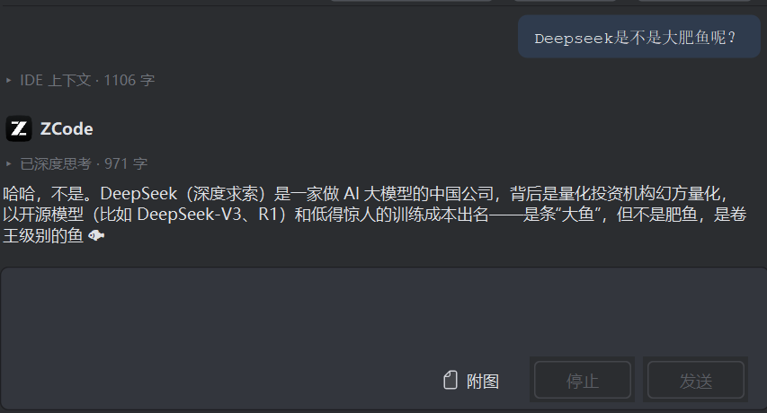

# ZCode Assistant for IntelliJ IDEA

在 IDEA 里与 [ZCode](https://zai.love/) AI 编码助手对话的插件：右侧 ToolWindow 聊天、选区/图片作为上下文、模型与思考强度切换、工具调用弹窗审批、修改的文件一键 diff、历史会话恢复与删除。

> ⚠️ 本项目为社区开发的**非官方**插件，与 Z.ai / ZCode 官方无隶属关系；插件不分发 ZCode runtime，运行时与图标素材来自用户本机安装的 ZCode。

> 📐 想了解架构与具体实现，请阅读 **[docs/ARCHITECTURE.md](docs/ARCHITECTURE.md)**（模块职责、协议事件流、线程模型、设计决策、构建坑）；协议逆向细节见 [docs/PROTOCOL.md](docs/PROTOCOL.md)。

<p align="center">
  
</p>

## 架构

```
IDEA 插件（Kotlin）
 ├─ ToolWindow 聊天面板（Swing，流式渲染助手输出/工具卡片）
 ├─ ZcodeSessionService —— 会话/进程管理，事件流翻译
 │    ├─ AppServerClient —— stdio 上的行式 JSON-RPC（ZCode Protocol）
 │    │    └─ spawn: node <zcode.cjs> app-server --cwd <项目根>（桌面端同款通道）
 │    └─ ZcodeCliConfig —— 解析 ~/.zcode 配置，构造模型目录回推与 runtimeModel
 ├─ SelectionContext —— 发送时读取编辑器选区/活动文件，注入 prompt
 └─ VFS 刷新 + DiffManager —— 感知并展示 zcode 对磁盘文件的修改
```

职责边界：代码搜索/阅读/修改由 zcode runtime 自己完成（ripgrep + Read/Edit/Write + 其自带 LSP 插件），直接操作磁盘文件；插件负责 IDE 上下文注入、审批交互、变更感知与展示。协议细节见 [docs/PROTOCOL.md](docs/PROTOCOL.md)。

## 前置条件

- IntelliJ IDEA 2024.3+（构建基于本机 IDEA 2025.2.4）
- JDK 21（用于构建；运行由 IDE 自带 JBR）
- Node.js >= 22.19（需内置 `node:sqlite`，删除历史会话时用到）
- zcode 运行时（自动探测顺序如下，均可在设置页覆盖）：
  1. **ZCode 桌面端**安装目录（`<安装目录>\resources\glm\zcode.cjs`，首选，无需第三方包）
  2. `zcode-app-cli`（`npm i -g zcode-app-cli`，npm 全局目录下 `vendor/zcode.cjs`，回退）
- 已配置凭证：`~/.zcode/cli/config.json`（provider + API key，或已通过 `zcode login` 等方式配置）；多模态识别依赖 `~/.zcode/v2/config.json` 中的模型 modalities 元数据（桌面端维护，装了桌面端就有）

## 构建与安装

```bash
# Windows（Git Bash）
# 构建用 JDK：推荐标准布局的 JDK 21（如 Amazon Corretto 21 / Temurin 21）
# 注意：Microsoft OpenJDK 会因缺少 Packages 目录导致 instrumentCode 失败，
#       被打补丁的 JBR 会干扰 Gradle 测试执行器，均不建议用作构建 JDK
export JAVA_HOME="C:/Users/<你>/.jdks/corretto-21.0.12.1"
./gradlew.bat buildPlugin
# 产物：build/distributions/zcode-idea-plugin-<version>.zip
```

IDEA 中安装：Settings → Plugins → ⚙ → Install Plugin from Disk → 选择上面的 zip。

> 构建默认使用本机 IDEA（`build.gradle.kts` 中 `intellijIdeaLocal("D:/IntelliJ/...")`）。
> 换机器时改为 `intellijIdea("2024.3")`（联网下载平台依赖）。

开发调试：`./gradlew.bat runIde`（沙箱 IDE）。

## 使用

1. 打开右侧 **ZCode** 工具窗口，直接输入问题（Enter 发送，Shift+Enter 换行）。
2. 发送时自动附带：当前活动文件路径、选中的代码（带行号，超过上限截断）、打开的文件列表（可在设置中关闭）。附带的上下文在消息气泡下方折叠展示（点击展开），不挤占正文。
3. 编辑器中选中代码 → 右键 → **ZCode**：
   - **引用选中代码到对话...**：把选区挂为待发送上下文（输入框上方显示引用条，可移除），聚焦输入框，补充问题后随消息一起发出；
   - 解释 / 优化 / 写测试 / 自定义指令：直接发送模板指令。
4. **图片输入**（当前模型支持时）：输入框 **Ctrl+V 粘贴剪贴板图片**，或点「附图」按钮选文件（可多张），缩略图 chip 展示、可移除，随下一条消息发送。附图入口按当前模型是否多模态自动启停。
5. 工具审批：edit/build 模式下，zcode 执行 Write/Edit/Bash 等工具前会弹窗，允许或拒绝；plan 模式只读；yolo 全自动（谨慎）。
6. **变更文件 (N)** 按钮列出本会话被 zcode 修改过的文件，点击用 IDE 原生 diff 对比修改前内容。
7. **新会话 / 恢复…**：会话持久化在 zcode 侧（`~/.zcode/cli/`），可跨 IDE/CLI 恢复；恢复列表每行带 🗑 删除按钮（确认后从 zcode 会话库删除该会话及其全部消息）。
8. 工具栏右侧可切换 **模型** 与 **思考强度**（低/高/最高，随模型变化）：切换立即作用于当前会话并被记住，之后新建/恢复的会话沿用。

## 设置

Settings → Tools → ZCode：node 路径、runtime 路径、默认权限模式、上下文注入开关与上限，附"检测环境"按钮。
模型与思考强度的选择持久化在插件设置里（无需手改；在工具栏下拉切换即生效并记住）。

## 常见问题

- **提示未找到 Node/runtime**：设置页手动指定，或先安装 ZCode 桌面端 / `npm i -g zcode-app-cli`；点"检测环境"查看探测结果。
- **恢复会话后发送报"历史任务使用的模型已不可用"**：已在新版本根治——插件连接时会把模型目录回推给 runtime，恢复时显式指定当前可用模型。若仍出现，确认 `~/.zcode/cli/config.json` 里的 provider/模型有效。
- **附图按钮是灰的**：当前模型不支持图像输入（如 glm-5.3 纯文本）。切到多模态模型（如 glm-5.3-flash）即可；能力标识来自 `~/.zcode/v2/config.json` 的 modalities。
- **权限弹窗迟迟不出现**：zcode 进程可能正忙；确认工具窗口底部状态；必要时点"停止"。
- **yolo 模式**：工具全自动执行（包括 shell），仅在可信项目使用。
- **会话与桌面端共享吗**：会话数据在用户目录下共享（同一 `~/.zcode` 库），但本插件独立于 ZCode 桌面端运行，不需要桌面端开着。
- **删除的会话能找回吗**：不能。删除直接作用于 `~/.zcode/cli/db/db.sqlite`（含消息级联），删除前有确认弹窗。
- **Java 项目的 jdtls**：zcode 自带的 LSP 插件会随会话启动（内存开销较大）。本插件默认不动该配置；后续版本计划提供"IDE 会话禁用 zcode LSP 插件 + IDEA 诊断注入"选项。

## 路线图（见 docs/PROTOCOL.md 附录）

- IDEA 诊断（错误/警告）作为上下文/工具暴露给 zcode
- 终端 TUI 模式（集成终端跑 zcode，IDE 作为 MCP server 提供选区/诊断工具）
- 更丰富的 markdown 渲染（代码高亮）、变更文件实时列表、消息排队
